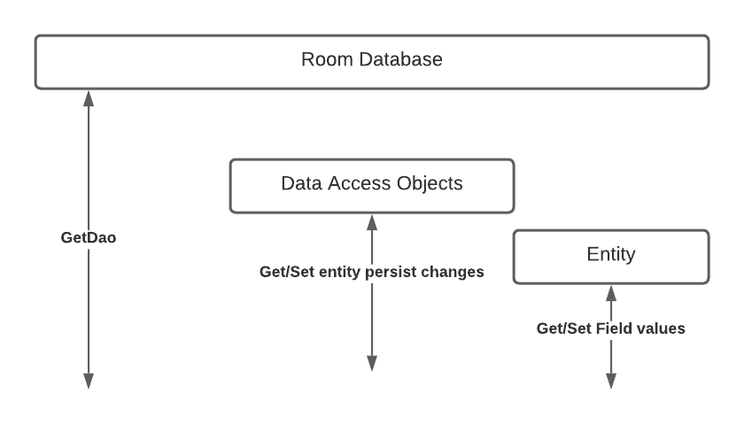
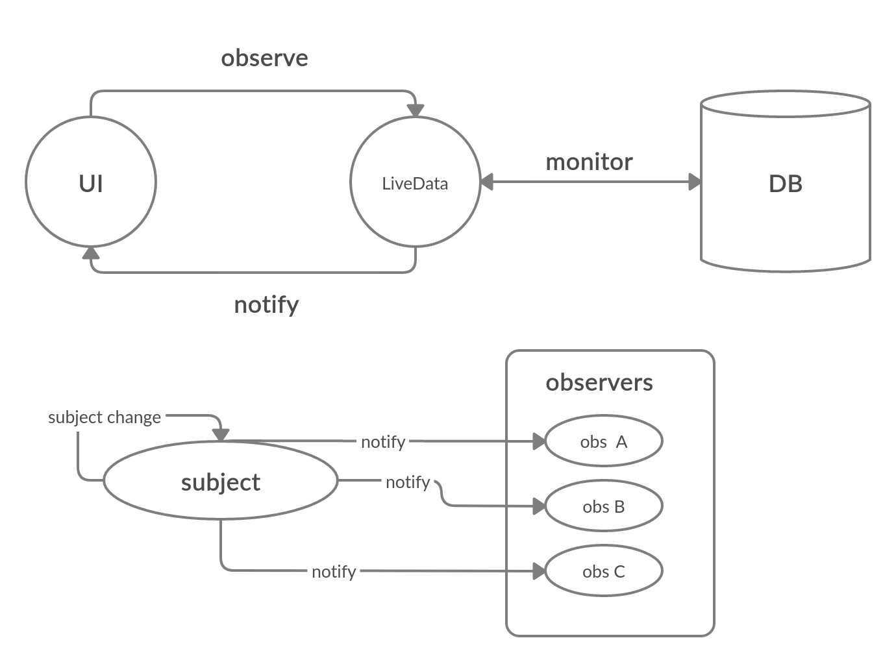
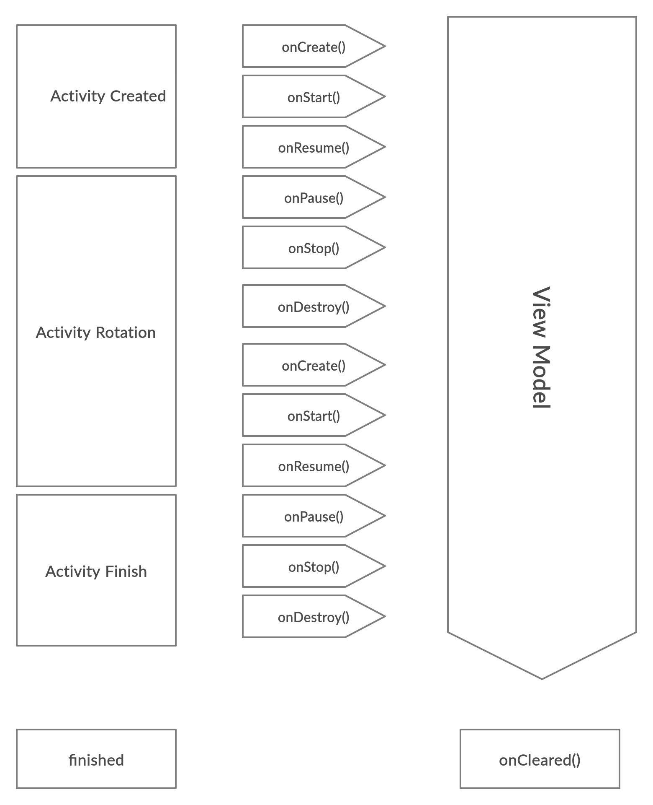

# Android Architeture components :


1. Room: new SQLite object Relational mapping library.
2. LiveDate: to observe changes in the database.
3. ViewModel: to chache data (during configuration changes).
4. LifeCycle: to Allow non-LifeCycle objects to be Life Cycle aware.


## RoomDB :

### features :
1. less boilerplate.
2. SQL validation at compile time.
3. built to work with LiveData and RXJava for data observation

### Annotaions :
@Entity : tubles.
@DAO : api for reading and writing data.
@Database : database holder.


### more on @DAO :
* DAO is an interface with the DAO notation.
* each method will have a @query notation that will connect the method to a query.
* @ update annotation is used for the updating sqllite statememtns like update,insert.
* @update annotation can have the attribute (onConflict=on(OnConflictStratigy.REPLACE)))
* the onConflict attribute can have one of the following values (ABORT,FAIL,IGNORE,REPLACE,ROLLBACK)
  to read more about them please visit the following link:
* @delete is for the delete SQL statment.
  
* another annotation that is available is @TypeConverter{DataConverter.class} // give it a converter class...




### coded example:

database initilization and creation...
```
// database initilization and creation...

public abstract class AppDatabse extends RoomDatabase {

private static AppDatabase instance ;

private static final Object sLock = new Object() ;

//
public abstract TaskDao getTasks() ;


public static AppDatabase getInstance(Context mContext){
	synchronized(sLock){
		if(instance == null){
		instance = Room.databaseBuilder(context.getApplicationsContext(),AppDatabase.class,"db-name")
			.build();
		}
	return instance ;
}}

}

```

```
database entity(table) :

@Entity
public class Tasks {
@Primarykey(autoGenerate = true)
private int id ;
// if you want the column name to be different than the variable name...
@ColumnInfo(name= "note_content")
private String to-do;
// or u can just leave it like this so the column will take the name of the variable...
private String title;


/*

you should also create the normal constructor and getters and setters for the interface to be able to use them...

*/
}
```
the DAO interface...


```
public interface TaskDAO {

@Insert(onConflict = OnConflictStrategy.REPLACE)
public void insertTask();

@Update(onConflict = OnConflictStrategy.REPLACE)
public void updateTask() ;

@Query("DELETE FROM tasks")
public void deleteAllTasks() ;

@Query("SELECT * FROM tasks")
public ArrayList<Task> getTasks() ;

}
```

## Live Data :



* live data allows you to monitor the data source using observes and change the ui depending on changes in the database in real time.

* savedinstancesState, can be used on orientation changes to  save the data but it's meant to be used for small amounts of data that can be serilized and deserialized easily(no using it for entire lists) .

### alternatives :
1. query database again on orientation changes.
2. ViewModels : allows data to servive configuration changes (E.g: rotation).


## View Models :



* we can cache complex data our ViewModel.
* view model can be cached.
* view model prevents memory leaks.
* lifecycle owner: objects with a  lifecycle like Activities and fragments.
* life cycleobserver : observs Lifecycle owner and get notified on life cycle changes.
