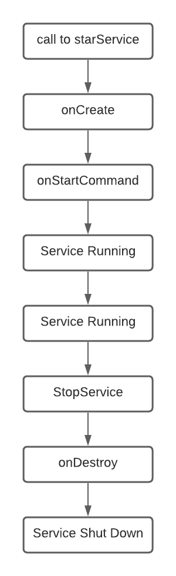
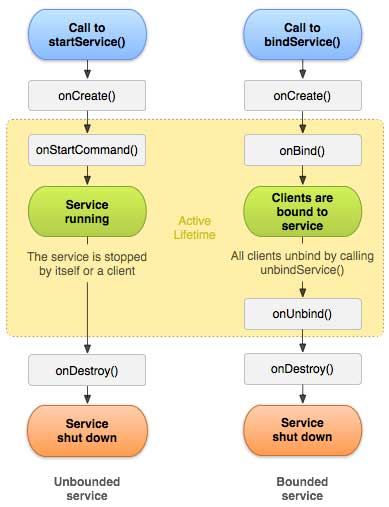
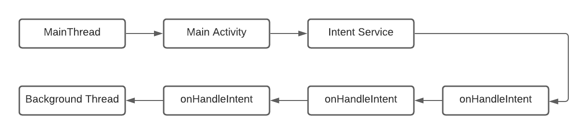

# Background Processes


## Services:

* services : are meant for long running background tasks that don't need a visual component.
* runs even if the Activity/app is closed.
* Loader is used when:
  1. tied to the Activity life cycle.
  2. easy to make user interface changes  and communicatte with activities.
* service is used when:
1. de coupled from the user interface.
2. exists even when there is no user interface.

* ways to start a service:
1. start.
2. scheduale.
3. bind.

* JobService : is a service that executes at some point in the future or when some condition is met.
* Schedualer : defines when a JobService should run.
* bound services can easily comunicate back to the component(components like ui sound controlers).E.g: sound data .


### Service Life Cycle :





### service intent requests :





## Notifications:

* create a notification channel object :
  ```
  NotificationChannel channel = new NotificationChannel() ;

```
* you can add groups within the channels.
* notification badges .
* notification manager.
* we get system services using
  ```
  //Context.getSystemService(String);
  Context.getSystemService(Context.NOTIFICATION_SERVICE);
  ```
## three laws of android Resource management:

1. Android will keep all apps that interact with the user running smoothly.
2. Android will keep all apps with visible activities followed by service running,  unless this violates the first law.
3. Android will keep all apps in the background running unless this violates the first or the second rules.
