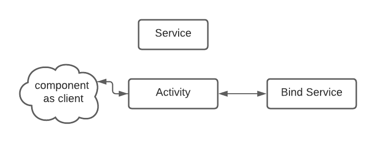

# Background Processes


## Services:

* services : are meant for long running background tasks that don't need a visual component.
* runs even if the Activity/app is closed.
* Loader is used when:
  1. tied to the Activity life cycle.
  2. easy to make user interface changes  and communicatte with activities.
* service is used when:
1. de coupled from the user interface.
2. exists even when there is no user interface.

* ways to start a service:
1. start.
2. scheduale.
3. bind.

* JobService : is a service that executes at some point in the future or when some condition is met.
* Schedualer : defines when a JobService should run.
* bound services can easily comunicate back to the component(components like ui sound controlers).E.g: sound data .




### Service Life Cycle :


### service intent requests :


## Notifications:

* create a notification channel object :
  ```
  NotificationChannel channel = new NotificationChannel() ;
```
```
* you can add groups within the channels.
* notification badges .
* notification manager.
* we get system services using

```
  //Context.getSystemService(String);
  Context.getSystemService(Context.NOTIFICATION_SERVICE);
  
  ```
  
## three laws of android Resource management:

1. Android will keep all apps that interact with the user running smoothly.
2. Android will keep all apps with visible activities followed by service running,  unless this violates the first law.
3. Android will keep all apps in the background running unless this violates the first or the second rules.


## Job scheduler :
* an API for scheduling various types of jobs against the framework that will be executed in your application's own process.
* JobScheduler started from API 24.

```

// define the service in the manifest...


<service android:name=".TestJobService"
	 android:label="test service"
	 android:permission="android.permission.BIND_JOB_SERVICE">


</service>

// define the jobe service class ...

public class TestJobService extends JobService {
	private static final String TAG = "syncService" ;

 	@override
	public boolean onStartJob(JobParameter params){
		Intent service = new Intent(getApplicationContext(),TestServiceLocal.class);

	}

	@override
	public boolean onStopJob(JobParameters params) {
		return true ;
	}
}


// in a utils class (or a sync class )
public static scheduleJob(Context context){

JobScheduler js = (JobScheduler) Context.getSystemService(Context.JOB_SCHEDULER_SERVICE);
JobInfo.Builder builder = new JobInfo.Builder(MY_BACKGROUND_JOB,new ComponentName(context,TestJobService.class));
builder.setMinimumLatency(1*10000); // wait at least ...
builder.setOverrideDeadline(3*1000); // maximum delay...

js.schedule(builder.build());
}
```


## FirebaseJobDispatcher :
* firebase job dispatcher works from APi 14 so better for backwards compatibility that JobScheduler...

```
Driver driver = new GooglePlayDriver(context) ;
FirebaseJobDispatcher dispatcher = new FirebaseJobDispatcher(driver);

Job j = dispatcher.newJobBuilder()
.setService(MyJobService.class)
.setTag("complex-job")
.setLifetime(Lifetime.UNTIL_NEXT_BOOT)
.setTrigger(Trigger.executtionWindow(0.99))
.setReplaceCurrent(true)
.setRetryStrategy(RetryStrategy.DEFAULT_EXPON)
.setConstraints(Constraint.ON_UNMETERED_NETWORK) // only run on unmettered network...
.build() ;


```


## Work Manager:

* WorkManager is a library of scheduling and executing defeeable background work on Android.
* it's a recommended replacement for Firebase JobDispatcher.
* WorkManager also supports backwards compatibility but it's better than the firebase dispatcher in the sence that it will use the appropriate library for the current api instead of just using the FirebaseDispatcher or the JobSchedule.
* workmanage is used for synchronous tasks that don't need to upload the ui or give us information in real time (E.g: real time location information).
