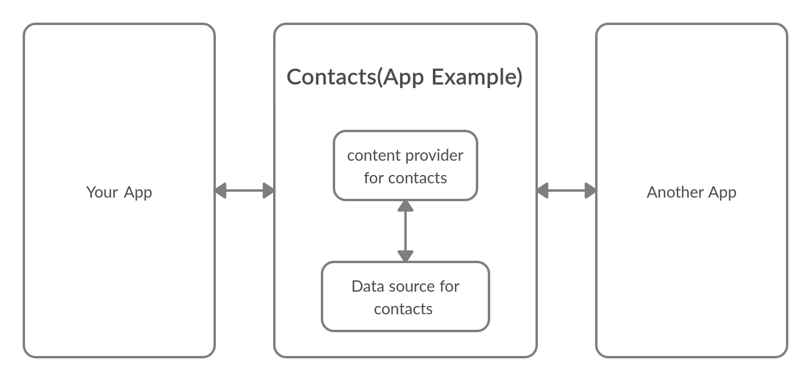

# Content Providers


* A content provider manages Access to a central repository of data.
* content providers allow you to add data or access data from or to other applicaitons.
* content provider sits between an app and it's data source and it's job is to provide managed Access to the underline data source.
* not using a content provider limit data access to only your app.


## Advanteges :

1. Extra level of Abstruction(allowing developers to change the underline data source without needing to change any code in the app itself).
2. leverage functionality of And classes. (uses content providers. E.g: Loaders).
3. Allow many apps to access, use and modify a single data source securely.





## General steps for using a content provider :

1. get permission to use the content provider (add the permission in the manifest of the application).
2. Get the content provider.
3. pick one of four basic actions on the data(CRUD - Create , Read , update , delete).
4. identify the data you are reading or manipulating to create a URI
5. in the case of reading from the content provider display the information in the UI.


* the general url of the content provider is like the following:
  content://{content authority (which content provider to use-usually package name-)/{terms(path specified to content provider)}}


* the following code shows u how to read from a content provider:
```
// the following code is just explanatory and does not compile or work without fixing it first....
ContentResolver res =getContentResolver(verc);
// fill the parameters as necessary
Cursor c = res.query(uri,projection,selection,seletion args, sort order);
// projection : filter columnts .
// selection : statement for how to filter rows .
// seleargs : what to filter .
// sort order  : how to order result.

int wordCol = cursor.getColumnIndex("word"); // column name or header ... this method gets the index of a column from it's name ...
int defCol = cursor.getColumnIndex("definition"); // column name or header ...

// looping through results ...
while(cursor.moveToNext()){
	String word = cursor.getString(wordCol);
	String def = cursor.getString(defCol);
}

cursor.close() ;
```
