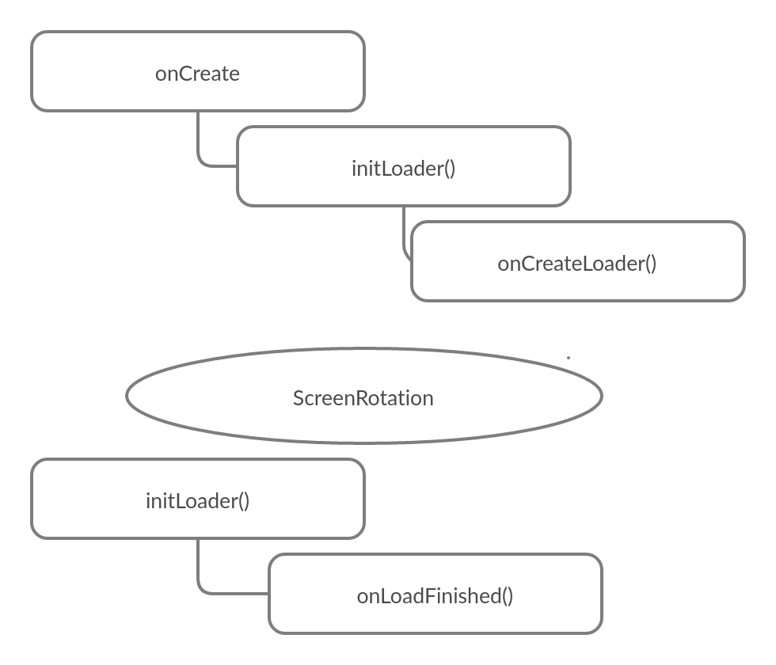

# Activity LifeCycle

the life cycle of the activity from the creation to the destruction and some problems and best practices.


## what may change the Activity state?
* implicit intents and dialogs may change the activity state from Active to visible so you're going to want to manage resources onPause and onResume if something might change in this case (going from visible to active and the reverse of that).
* when Rotating
  onPause => onStop => onDestroy => onCreate => onStart => onResume

* saveInstanceState may be used to save and reload the state of the activity state onCreate...
we can do this be overriding the method onSaveInstanceState(Bunde outState), and checking if there is a saved stateonce the Activity is created like the following:

```
public void onSaveInstanceState(Bundle outState){
// could put the same stuf you can put in a normal bundle (primitives and parcelables)
outState.putString("message","this is a test message");
super.onsaveInstanseState(outState);
}
// and in onCreate we add the following code ...
// savedInstanceState is provided from the parameter of the onCreate method as onCreate(Bundle savedInstanceState)
if(savedInstanceState != null) {
// get a mesasge here to a globel variable or do with it whatever you want to populate views in the activity.
String message = savedInstaneState.getString(message);
Toast.makeText(this,message , Toast.LENGTH_LONG).show();
}

// this way of keeping the data on rotation is kind of old and instead we currently use ViewModels(but you may wanna still use this for older APIs )
```

* in onPause,onStop we should clean and close connections.


## Async Task in onCreate lifecycle problem And solution :

* Async Tasks in on create is a bad idea (because it doubles the background process on rotation while it delivers the result of the first background process to a zombie activity and use the second activity ):
 - which means it will double any process of fetching data from the internet (using double the data actually needed ) or call the database twice if we have cached data(which in turns affects overall memory usage and processing usage)
 - also when that happens the zombie Activity gets preserved by the background process and doesn't get destroyed which result in the activity stay in the activities stack even thought it's unreachable.


### Loaders(solution):

* using a loader instead will prevent the duplication of background processes since loaders will only restarts if the user navigates away from the Activity and then comes back to it.




### creating Loaders:
1. create a Loader ID .
2. filling Loader callbacks.
3. ini Loader with Loader manager.
