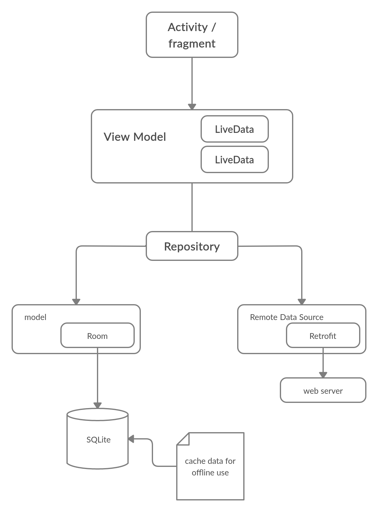
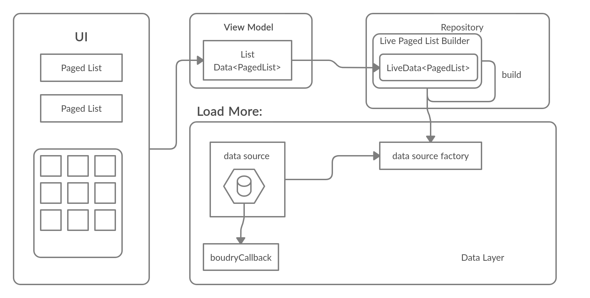

# MVVM patter design

* The movie repository contains two data sources, Network , and database.
* The Repository merges the content of the data sources via MediatorLiveData , in order to avoid duplicate content,  we defined DIFF_CALLBACK in the model.

## coding example:

