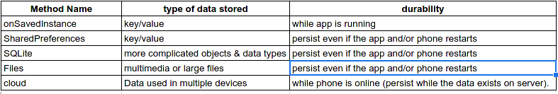

# preferences

preferences are one of the way that allows us to make our data persistant.

## Data Persistence:

## preferences Activity:

* SharedPreferences is good for creating preferences Activity (like a settings page).
* we can create a fragment called PreferencesFragment which is better than PreferenceActivity is depricated.
* remember to add some attributes to the preference Activity when you create it (not the class PreferenceActivity but the normal Activity you create to display the PreferenceFragment ).
* in onCreate add the registration for the fragment and un register in the onDestroy.

### types of views you can use in the fragment :
- CheckboxPreference.
- ListPreference.
- EditTextPreference.

  (more will be added to this file later (sample code and detailed instructions ))
